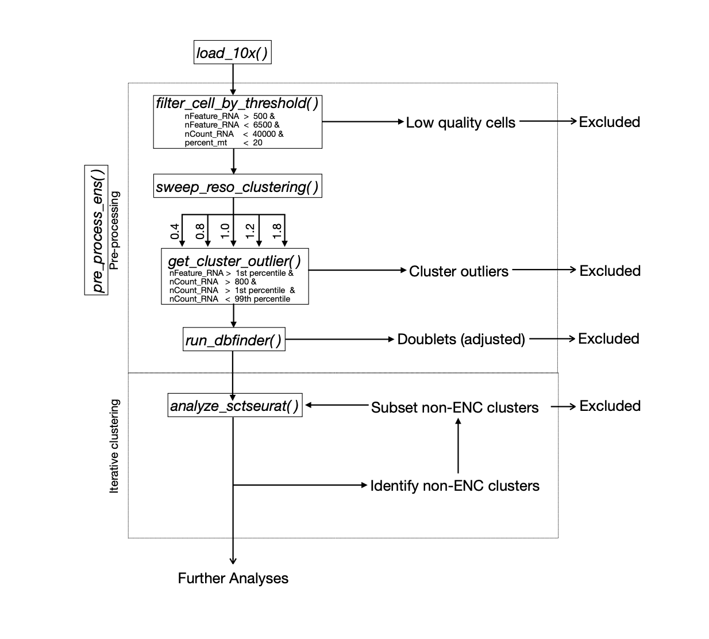

# Enteric Neuron Subtype Analysis Workflow

This repository provides a workflow for analyzing enteric neuron subtypes using single-cell RNA sequencing (scRNA-seq) data processed with the **Seurat** framework. It accompanies the manuscript *Discovering the transcriptomes, connections, and development of submucosal neuron classes in the mouse small intestine* (Li and Morarach et al., 2024). The associated data is deposited in the Gene Expression Omnibus (GEO) database under the identifier [**GSE263422**](https://www.ncbi.nlm.nih.gov/geo/query/acc.cgi?acc=GSE263422).

The analysis procedures described in the manuscript are wrapped into a series of custom functions with adjustable parameters for reproducibility and ease of use. The main script, `RSCRIPT.R`, is organized into three parts:

- **Part 1: Libraries** – Load required R packages.  
- **Part 2: Functions** – Define custom functions for preprocessing and analysis.  
- **Part 3: Analyses** – Perform the analyses, organized into four main sections.
- (1) General Workflow for Cluster Analysis (Compatible with Seurat v5)
- (2) P24 Submucosal Plexus Cluster Analysis
- (3) P7 Small Intestine (ENS) Cluster Analysis
- (4) Label Transfer 

To follow this workflow, first load the Libraries and Functions sections of the `RSCRIPT.R` file. These only need to be loaded once per session. The Analyses section can then be executed as needed.

## Download data: 
- Raw Data for P24 Submucosal Plexus GEO accession numbers: [GSM8191472](https://www.ncbi.nlm.nih.gov/geo/query/acc.cgi?acc=GSM8191472), [GSM8191473](https://www.ncbi.nlm.nih.gov/geo/query/acc.cgi?acc=GSM8191473), [GSM8191474](https://www.ncbi.nlm.nih.gov/geo/query/acc.cgi?acc=GSM8191474)
- Raw Data for P7 Small Intestine ENS GEO accession numbers: [GSM8191470](https://www.ncbi.nlm.nih.gov/geo/query/acc.cgi?acc=GSM8191470), [GSM8191471](https://www.ncbi.nlm.nih.gov/geo/query/acc.cgi?acc=GSM8191471)
- [Processed P24 submucosal plexus](https://drive.google.com/file/d/1orbvUEjSYKwx-IuV4US_vUiFzk13xO1u/view?usp=drive_link)
- [Processed P7 small intestine ENS](https://drive.google.com/file/d/1jsALFSSyUJTjgR6a_sj0qIgpLP5YNWG8/view?usp=drive_link)
- [ENS reference datasets for label transfer](https://drive.google.com/file/d/1Lmi6wDMmlhZ8JfWe2vmzS18qnWz4-Jqc/view?usp=drive_link)

---
## Analysis Overview

#### Main functions
*For details, refer to the comments and descriptions embedded in the script.*
1. **Data Loading**
   - **`load_10x()`**: Load single-cell RNA sequencing data from 10x Genomics.
2. **Pre-processing**
   - **`filter_cell_by_threshold()`**: Exclude low-quality cells based on thresholds for `nFeature_RNA` and `nCount_RNA`.
   - **`get_cluster_outlier()`**: Exclude extreme outliers, sweeping different resolution values.
   - **`run_dbfinder()`**: Exclude doublets by `DoubletFinder` (with Seurat’s SCT)
3. **Iterative Clustering and removing of non-relevant clusters**
   - **`analyze_sctseurat()`**: Identify and subset non-enteric neuron clusters iteratively.
---
#### **Example of Dataset loading**
Specify the folders containing paths to the CellRanger's output, `filtered_feature_bc_matrix`:
```R
folders <- list(
  "~/sm022/filtered_feature_bc_matrix",
  "~/sm023/filtered_feature_bc_matrix",
  "~/sm024/filtered_feature_bc_matrix"
)
load_sm <- load_data_10x(folders, seurat_object_version = "v5") #for Seurat v5
```
---
## Library Requirements
- `R 4.4.1`
  
This script works with the following package versions:
- `cols4all: v0.7-1`
- `reticulate: v1.39.0`
- `patchwork: v1.3.0`
- `clustree: v0.5.1`
- `ggraph: v2.2.1`
- `ggplot2: v3.5.1`
- `DoubletFinder: v2.0.4`
- `dplyr: v1.1.4`
- `Seurat: v5.1.0`
- `SeuratObject: v5.0.2`
- `sp: v2.1-4`
- `stringr: v1.5.1`
### Reproducibility Requirements
To reproduce the results, specific package versions are required:
- `Seurat: v4.1.3`
- `DoubletFinder: v2.0.3` (for functions `paramSweep_v3()` and `doubletFinder_v3()`)
---
## Citation
```
Discovering the transcriptomes, connections, and development of submucosal neuron classes in the mouse small intestine.
Wei Li1,#, Khomgrit Morarach1,#, Ziwei Liu1, Sanghita Banerjee1, Yanan Chen1,  Ashley L. Harb2,3, Joel M. Kosareff2,3, Charles R. Hall2,3, Fernando López-Redondo1,4, Elham Jalalvand1, Suad H. Mohamed2,3, Anastassia Mikhailova1, David R. Linden2,3, Ulrika Marklund1,*

#These authors contributed equally
*Correspondence:
Ulrika Marklund (PhD), Karolinska Institute Department of Medical Biochemistry and Biophysics, Division of Molecular Neurobiology, Biomedicum C6, Tomtebodavägen 16, SE-171 65, Stockholm, Sweden. Email: Ulrika.Marklund@ki.se
Telephone: +46 702931870
```
---
